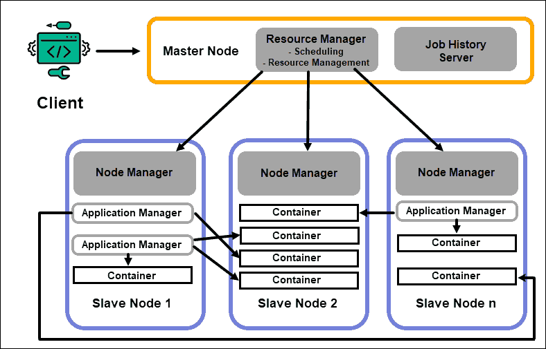

//TODO: Index Creation

## Hadoop

Has HDFS and MapReduce
- HDFS (Hadoop Distributed File System) - responsible for maintaining data
- MapReduce – responsible for executing tasks, process data in parallel, fault tolerant. Java, Python,C & C++
- Between each map/reduce steps it shuffles data over network writes intermediate data to disk. (100 times slower than memory)

Abstraction of MapReduce
- Hive (FB) - Interact with sql backend is Java. Query Engine
- Pig (Yahoo) - PigLatin
- Scoop (Java) - bring data from RDBMS dump into HDFS and vice Versa
- Oozie (Java) - Scheduler of jobs (Like Control M)

Computation frameworks such as Spark, Storm, Tez now enable real-time processing, interactive query processing and other programming options that help the MapReduce engine and utilize HDFS much more efficiently.

### HDFS

- It is fast. 2GB data per second
- It is free. Open Source Software
- It is reliable. The file system stores multiple copies of data in separate systems to ensure it is always accessible.

#### Data Block Splitting

- HDFS divides files into blocks and stores each block on a DataNode. Multiple DataNodes are linked to the master node in the cluster, the NameNode. The master node distributes replicas of these data blocks across the cluster. It also instructs the user where to locate wanted information.
- However, before the NameNode can help you store and manage the data, it first needs to partition the file into smaller, manageable data blocks. This process is called data block splitting
- By default, a block can be no more than 128 MB in size.

#### Data Replication

- Based on the cluster’s configuration, the NameNode creates a number of copies of each data block using the replication method.
- It is recommended to have at least three replicas, which is also the default setting. The master node stores them onto separate DataNodes of the cluster.
- The state of nodes is closely monitored to ensure the data is always available.

//TODO: Sub Point formatting
* Store the first replica on the node where the client is located.
* Then, store the second replica on a different rack.
* Finally, store the third replica on the same rack as the second replica, but on a different node.

##### NameNodes

- Contain Metadata of the data (File Location, Data Size etc)
- Enterprise level hardware since NameNode is the most important piece
- One 1 active NameNode
- Master daemon which manager DataNodes
- Does block operations creation, deletion and replication in background

Metadata is maintained by two files:
- editlog : Keeps track of recent change made to HDFS
- fsimage : Keeps track of every change since the beginning

**Zookeeper is a lightweight tool that supports high availability and redundancy. A Standby NameNode maintains an active session with the Zookeeper daemon. If an Active NameNode falters, the Zookeeper daemon detects the failure and carries out the failover process to a new NameNode.**

##### DataNodes

- Slave Daemon
- Uses commodity hardware since it's cheap. It may be prone to failures but data is replicated 3x
- Stores actual data

### HDFS Read Mechanism

1. Opens a connection with DFS
2. Get block location via RPC (Remote Procedural Calls) to NameNode
3. NameNode checks if Client in authorized to make to access the file. If Yes, provides the block location. Informs Data nodes with token that client is going to request for the data.
4. Now client requests for data to DataNode with the token

### HDFS Write Mechanism

### HDFS CLI
<pre>
hdfs dfs -ls                              # List Files
hdfs dfs -put <fileName>                            # Copy
hdfs dfs -cat <fileLocation/fileName>                            # Print content on screen
hdfs dfs -mv fileName fileNewName         # Move / Rename
hdfs dfs -rm -r <fileName>                          # Delete
hdfs dfs -mkdir myDir                     # Make Directory
hdfs dfs -du                              # Display Sizes of file
hdfs dfs -count                           # Display Sizes of file
</pre>

### MapReduce

- MapReduce is a parllel processing module in the Apache Hadoop project
- MapReduce is a programming algorithm that processes data dispersed across the Hadoop cluster.
- By using the resources of multiple interconnected machines, MapReduce effectively handles a large amount of structured and unstructured data.
- At a high level, MapReduce breaks input data into fragments and distributes them across different machines.
- The input fragments consist of key-value pairs. Parallel map tasks process the chunked data on machines in a cluster. The mapping output then serves as input for the reduce stage. The reduce task combines the result into a particular key-value pair output and writes the data to HDFS.
- The Application Master locates the required data blocks based on the information stored on the NameNode. The AM also informs the ResourceManager to start a MapReduce job on the same node the data blocks are located on. Whenever possible, data is processed locally on the slave nodes to reduce bandwidth usage and improve cluster efficiency.

The Map and Reduce stages have two parts each.

- A Map Task is a single instance of a MapReduce app. The Map part first deals with the splitting of the input data that gets assigned to individual map tasks. Then, the mapping function creates the output in the form of intermediate key-value pairs.
- A Reduce Task processes an output of a map task. The Reduce stage has a shuffle and a reduce step. Shuffling takes the map output and creates a list of related key-value-list pairs. Then, reducing aggregates the results of the shuffling to produce the final output that the MapReduce application requested.The map outputs are shuffled and sorted into a single reduce input file located on the reducer node. A reduce function uses the input file to aggregate the values based on the corresponding mapped keys. The output from the reduce process is a new key-value pair. This result represents the output of the entire MapReduce job and is, by default, stored in HDFS.

#### Map Phase

#### Reduce Phase

CLI Commands:

- `start-all.sh` or `start-dfs.sh or start-yarn.sh`
- `jps` (Java related processes)
- `ssh m1`

## Yet Another Resource Negotiator (YARN)

- YARN’s resource allocation role places it between the storage layer, represented by HDFS, and the MapReduce processing engine.

- **The ResourceManager (RM)** daemon controls all the processing resources in a Hadoop cluster. Its primary purpose is to designate resources to individual applications located on the slave nodes. It maintains a global overview of the ongoing and planned processes, handles resource requests, and schedules and assigns resources accordingly.The ResourceManager (RM) daemon controls all the processing resources in a Hadoop cluster. Its primary purpose is to designate resources to individual applications located on the slave nodes. It maintains a global overview of the ongoing and planned processes, handles resource requests, and schedules and assigns resources accordingly.
- **Scheduler in RM** : Capacity, Fair and FIFO Scheduler, is responsible for allocating resources
- **Application Manager in RM** : Responsible for accepting job submission,negotiate first container for executing application specific ApplicationMaster, restart ApplicationMaster in case of failures.
- **NodeManager** is present in each slave node, it also has a processing service and a DataNode storage service.The primary function of the NodeManager daemon is to track processing-resources data on its slave node and send regular reports to the ResourceManager.The container processes on a slave node are initially provisioned, monitored, and tracked by the NodeManager on that specific slave node.
- A **Container** has memory, system files, and processing space.Processing resources in a Hadoop cluster are always deployed in containers. A container deployment is generic and can run any requested custom resource on any system. If a requested amount of cluster resources is within the limits of what’s acceptable, the RM approves and schedules that container to be deployed.
- Every container on a slave node has its dedicated **Application Master**. Application Masters are deployed in a container as well. Even MapReduce has an Application Master that executes map and reduce tasks.As long as it is active, an Application Master sends messages to the Resource Manager about its current status and the state of the application it monitors. Based on the provided information, the Resource Manager schedules additional resources or assigns them elsewhere in the cluster if they are no longer needed.
- The **JobHistory** Server allows users to retrieve information about applications that have completed their activity. The REST API provides interoperability and can dynamically inform users on current and completed jobs served by the server in question.

### How Does YARN Work?

- The ResourceManager instructs a NodeManager to start an Application Master for this request, which is then started in a container.
- The newly created Application Master registers itself with the RM. The Application Master proceeds to contact the HDFS NameNode and determine the location of the needed data blocks and calculates the amount of map and reduce tasks needed to process the data.
- The Application Master then requests the needed resources from the RM and continues to communicate the resource requirements throughout the life-cycle of the container.
- The RM schedules the resources along with the requests from all the other Application Masters and queues their requests. As resources become available, the RM makes them available to the Application Master on a specific slave node.
- The Application Manager contacts the NodeManager for that slave node and requests it to create a container by providing variables, authentication tokens, and the command string for the process. Based on that request, the NodeManager creates and starts the container.
- The Application Manager then monitors the process and reacts in the event of failure by restarting the process on the next available slot. If it fails after four different attempts, the entire job fails. Throughout this process, the Application Manager responds to client status requests.

- ResourceManager is the master of processing layer, it will be receiving heartbeats from NodeManagers, NodeManager updates the status, available resources.

### YARN Client Mode Vs Cluster Mode

[Detailed Explanation](https://sparkbyexamples.com/spark/spark-deploy-modes-client-vs-cluster/)

- **Client Mode** : In client mode, the driver runs locally from where you are submitting your application using spark-submit command. client mode is majorly used for interactive and debugging purposes. Note that in client mode only the driver runs locally and all tasks run on cluster worker nodes.
-  **Cluster Mode** : 	In cluster mode, the driver runs on one of the worker nodes, and this node shows as a driver on the Spark Web UI of your application. cluster mode is used to run production jobs.

- [YARN](https://www.youtube.com/watch?v=knssVnPdJMA)
- [YARN Execution Flow - 2](http://geekdirt.com/blog/introduction-and-working-of-yarn/)
- [Oreilly YARN](https://www.oreilly.com/library/view/hadoop-the-definitive/9781491901687/ch04.html)

### High availability Cluster Implementation

