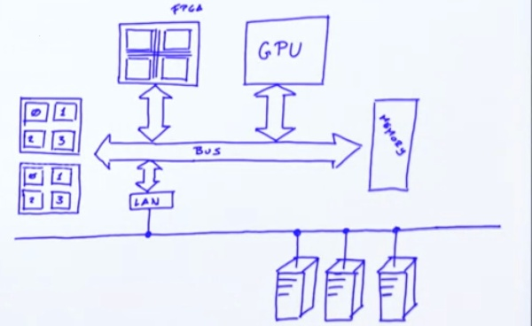

# Parallel Computing

- Parallel computing is a type of computation in which many calculations execute at the same time.
- Parallel computing is based on the following principle, a computational problem can be divided into smaller subproblems, which can then be solved simultaneously
- Parallel computing assumes the existence of some sort of parallel hardware, which is capable of undertaking these computations simultaneously.

 - Instruction level parallelism executes different instructions from the same instruction stream in parallel whenever this is possible
 - Task-level parallelism deals with parallel execution of entirely separate sequences of instructions. These instructions can execute on the same or entirely different data
 - Bit-level  parallelism deals with processing multiple bits in parallel

Bit-level and instruction-level parallelism are exploited by the underlying parallel hardware. In other words, they are in most cases implemented inside the processor itself.

## Parallel Hardware

- Multi Core Processor
- Symmetric Multi-Processor - A symmetric multiprocessor, or SMP, is a computer system with multiple identical processors, that share memory and connect to it by a bus. Here, multiple execution units are not on the same chip. An SMP itself can contain multi-core processors
- Graphics Processing Unit - GPGPU, is a form of a co-processor originally intended for graphics processing. As a core processor, it does not execute all user programs by default, but can execute a program when this is explicitly requested by the host processor.
- Field-programmable gate arrays - FPGA, is another form of a core processor which can rewire itself for a given task.
- Computer clusters - Groups of computers connected via a network that do not have a common shared memory. Sometimes computers in the cluster also have co-processors, such as GPUs, and then we call them heterogeneous clusters.

## JVM and Parallelism

- OS is a piece of software that manages hardware and software resources, and schedules program execution
- A process is an instance of a computer program that is executing inside the operating system.
- Each time a process is started, and executes, the operating system assigns it some resources, such as execution time on a CPU, memory address space, file handles or network ports.
- Each process can contain multiple independent concurrency units called threads.
- First threads can be started programmatically within the program. Making it easier to structure parallel computations, than it was with processes. Second, and more importantly, threads share the same memory address space. This enables them to share information by reading from, and writing to, memory.

- Atomicity : In concurrent programming, we call this atomicity. An operation is atomic if it appears as if it occurred instantaneously from the point of view of other threads
- 
