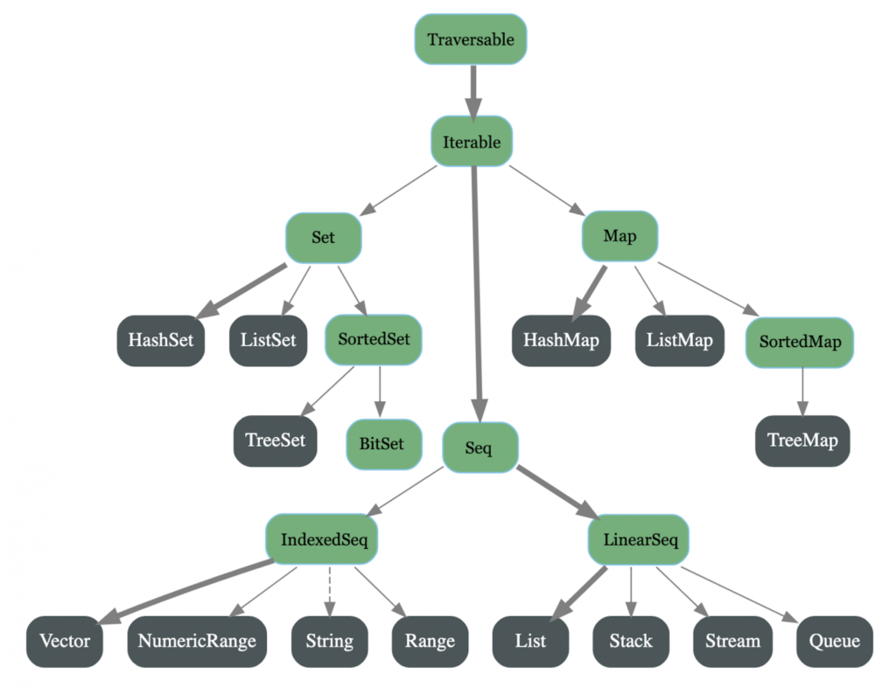

# Scala Concepts

- [Scala Style Guide : ](ScalaStyleGuide.md)
- [Scala Best Practices : ](ScalaBestPractices.md)
- [Parallel Programming : ](ParallelProgramming.md)
- [Does Scala's pattern matching violate the Open/Closed Principle](https://stackoverflow.com/a/564498)

Underneath Code can be viewed with below commands

```scala
scalac - Xprint:all *.scala //For viewing how syntactic sugar is handled
scalap className //How code looks after compilation using bytecode 
javap className //How equivalent Java code looks after compilation
```

## <a name='TOC'>Table of Contents</a>

1. [Objects are Everwhere](#pure-object-orientation-objects-are-everywhere)
    * [Functions as Objects](#functions-as-objects)
    * [Expansion of Function Values](#expansion-of-function-values)
    * [Expansion of Function Calls](#expansion-of-function-calls)
    * [Functions and Methods](#functions-and-methods)
2. [Functions](#functions)
    * [Higher Order Functions in Scala](#higher-order-functions-in-scala)
    * [Function Currying](#function-currying)
    * [Partially Applied Function](#partially-applied-function)
    * [Anonymous Function](#anonymous-function)
    * [Closure](#closure)
    * [Function Composition](#function-composition)
3. [Polymorphism](#polymorphism-in-scala)
    * [Parametric Polymorphism](#parametric-polymorphism)
4. [Variances in Scala](#variances-in-scala)
    * [Covariance](#covariance-ft)
    * [Contravariance](#contravariance-f-t)
    * [Invariance](#invariance-f_)
5. [Pattern Matching](#pattern-matching)
    * [Patterns in Match Expression](#patterns-in-match-expression)
    * [Extractors](#extractors)
    * [Others](#others)
6. [Collections](#collections)
    * [List](#list)
    * [Map](#map)
    * [Set](#set)
    * [Tuples](#tuples)
7. [Functional Combinators](#functional-combinators)
8. [Monads](#monads)
9. [Implicits](#implicits-vs-given-using)
10. [Given and Using](#given-and-using)
11. [Functors](#functors)

## <a name='PureObjectOrientation'>Pure Object Orientation (Objects are everywhere)</a>

In Java, there is a difference between an expression and a statement.

```java
int value=10;

        boolean result;

        if(value>20){
        result=true;
        }
        else{
        result=false;
        }
```

In Scala, almost everything(there are some exceptions) evaluates to an expression. Everything is a value in Scala. It's
just mostly syntactic sugar.

```scala
val number = 20

val s = {
  if (number > 10) {
    println("Number is greater")
  }

  else {
    println("Number is lesser")
  }
  "testing"
}

println(s)
```

Data types as Objects : There are no native data types in scala and all of the data types have a class of their own
Operations on types : All operations that we do in primitive java types such as +,-,* etc ., are implemented as methods.

## Functions as Objects

The function type A => B is just an abbreviation for the class `scala.Function[A,B]`, roughly defined as:

```scala
package scala

trait Function1[A, B] {
  def apply(x: A): B
}
```

### Expansion of Function Values

An anonymous function such as `(x: Int) => x * x` is expanded to

```scala
{
  class AnonFun extends Function1[Int, Int] {
    def apply(x: Int) = x * x
  }
  new AnonFun
}
```

Or, shorter, using anonymous class syntax, like in Java:

```scala
new Function1[Int, Int] {
  def apply(x: Int) = x * x
}
```

### Expansion of Function Calls

A function call, such as f(a,b), where f is a value of some class type, is expanded to f.apply(a,b)
So the OO-translation of

```scala
val f = (x: Int) => x * x
f(7)
```

would be

```scala
val f = new Function1[Int, Int] {
  def apply(x: Int) = x * x
}
f.apply(7)
```

### Functions and Methods

Note that anything defined with a def, ie, a method, like

```scala 
def f(x: Int): Boolean = ...
``` 

is not itself a function value; but if the name of a method is used in a place where a function type is expected, it's
converted automatically to the function value.

## <a name='Functions'>Functions</a>

Functions are first-class citizens

- We can use functions as values or like normal variables; we can replace a variable or value with a function
- We can assign a function literal to a variable
- We can pass one or more functions as another function's parameters
- We can return a function from another function

### Higher Order Functions in Scala

A function is called Higher Order Function if it contains other functions as a parameter or returns a function as an
output

eg: map is a HOF in scala which take function as an input

```scala
val list = 1 :: 2 :: 3 :: Nil
val multiplyBy2 = (x: Int) => x * 2
list.map(x => multiplyBy2(x))
```

### Function Currying

Currying is converting a single function of n arguments into n functions with a single argument each

```scala
val curriedSum: Int => Int => Int = x => y => x + y
println(curriedSum(1)(2))

def sum(x: Int)(y: Int): Int = x + y
def curriedSum1(x: Int)(y: Int): Int = x + y
val curriedSum2: Int => Int => Int = (sum _).curried
val curriedSum3: Int => Int => Int = sum
```

### Partially Applied Function

A partially applied function is a function where some of its arguments have already been filled in.

```scala
def log(time: Long, message: String) = {
  s"$time $message"
}

val logVal = log(System.nanoTime(), _)
```

### Partial Function

- A partial function is a function that does not provide an answer for every possible input value it can be given.
- PartialFunction is a trait

```scala
trait PartialFunction[-A, +B] extends (A)

=> B

val squareRoot: PartialFunction[Double, Double] = {
  def apply(x: Double) = Math.sqrt(x)

  def isDefinedAt(x: Double) = x >= 0
}


type Validator = PartialFunction[Int, Int]

val negativeToPositive = new Validator {
  override def isDefinedAt(x: Int) = x < 0

  override def apply(x: Int) = Math.abs(x)
}

val positiveToNegative = new Validator {
  override def isDefinedAt(x: Int) = x > 0

  override def apply(x: Int) = -1 * x
}

val default = new Validator {
  override def isDefinedAt(x: Int): Boolean = true

  override def apply(x: Int) = 0
}

val numVal = negativeToPositive
  .orElse(positiveToNegative)
  .orElse(default)


//Collect uses partial function instead of predicate in filter
val parseRange: PartialFunction[Int, Int] = {
  case x: Int if x > 10 => x + 1
}
List(15, 3, "aString") collect {
  parseRange
}
```

### Anonymous Function [Expansion](#expansion-of-function-values)

- Anonymous function in Scala — also known as a function literal using which you can pass it into a method that takes a
  function, or to assign it to a variable.

```scala
val list = 1 :: 2 :: 3 :: Nil
val evens = list.filter((i: Int) => i % 2 == 0)
```

`(i: Int) => i % 2 == 0` - Anonymous Function

### Closure

- A closure is a function which uses one or more variables declared outside this function
- Takes most recent value declare

```scala
var number = 100

val addNumber = (i: Int) => {
  i + number
}
println(addNumber(10))
```

### Function Composition

- Given two functions, f: X -> Y and g: Y -> Z, we can define their composition as a function h = g ∘ f : X -> Z, where
  h(x) = g(f(x))
- Function composition is always associative: f ∘ (g ∘ h) = (f ∘ g) ∘ h.
- The trait Function1[T1, R] defines methods to compose functions.
- There are two ways to compose such functions, according to Function1: compose and andThen.
- compose is g(f(x)) and andThen is f(g(x)), ordering of apply is different

```scala
    val add1 = (i: Int) => i + 1
val double = (i: Int) => i * 2
val addComposeDouble = double compose add1
println(addComposeDouble(1))

val doubleAndThenAdd = add1 andThen double
println(doubleAndThenAdd(1))
```

- .tupled is used in case of multiple parameters (Present inside Function trait)

```scala
def tupled: Tuple2[T1, T2] => R = {
  case Tuple2(x1, x2) => apply(x1, x2)
}
```

## <a name='Polymorphism'>Polymorphism in Scala</a>

### Parametric Polymorphism

We can easily recognize parametrically polymorphic functions in Scala by the presence of one or more type parameters
delimited by square brackets in the method signature — they enable us to apply the same logic to different data types.

**The Naive Solution** : Below works well for integer arrays but is not reusable for other types:

```scala
def pairWiseReverseInt(xs: List[Int]): List[Int] = xs.grouped(2).flatMap(_.reverse).toList
```

**DRY Solution** : With parametric polymorphism, the logic remains the same for all the different types

```scala
def pairWiseReverse[A](xs: List[A]): List[A] = xs.grouped(2).flatMap(_.reverse).toList
```

**Subtype Polymorphism** : The key concept in subtype polymorphism is substitutability as defined in the Liskov
substitution principle

```scala
trait Shape {
  def getArea: Double
}

case class Square(side: Double) extends Shape {
  override def getArea: Double = side * side
}

case class Circle(radius: Double) extends Shape {
  override def getArea: Double = Math.PI * radius * radius
}

def printArea[T <: Shape](shape: T): Double = (math.floor(shape.getArea) * 100) / 100
```

**Ad-Hoc Polymorphism** : The compiler switches between different code implementations depending on the type of input a
method receives.

**Method Overloading** : When calling **.sorted** method on list scala knows via Method Overloading to call which
function, but this doesn't apply to custom classes, where in we have to provide an implementation of Ordering type.

```scala
    val ord: Ordering[StudentId] = (x, y) => x.id.compareTo(y.id)
```

**Operator Overloading** : Scala supports operator overloading, which means that the meaning of operators (such as * and
+) may be defined for arbitrary types.

```scala
class Complex(val real: Double, val imag: Double) {
  def +(other: Complex) = new Complex(
    real + other.real,
    imag + other.imag)


  def (other: Complex) = new Complex(
    realother.real - imagother.imag,
    imagother.real + real * other.imag)


  def magnitude(): Double = Math.sqrt(realreal + imagimag)
}

var C = new Complex(x, y)
var Z = new Complex(0.0, 0.0)

var count = 0
while (count < THRESHOLD && Z.magnitude() < 2.0) {
  Z = Z * Z + C
  count += 1
}
```

This code determines whether a complex number C

## <a name='Variances'>Variances in Scala</a>

Variance is the interconnection of subtyping relationship between complex types and their component types. There are
three types of variance: covariance, contravariance, and invariance.

### Covariance F[+T]

We say that a type constructor F[_] is covariant if B is a subtype of type A and F[B] is a subtype of type F[A]. eg: If
S is subtype of T then List[S] is a subtype of List[T].

Covariance is type-safe because it reflects the standard behavior of subtyping.

```scala
class Shape[+T](polygon: T)

sealed trait Polygon

case object Parallelogram extends Polygon

val shape: Shape[Polygon] = new Shape[Parallelogram](List(new Parallelogram))
```

In Scala : List[T], Option[T], and Try[T].

### Contravariance F[-T]

We say that a type constructor F[_] is contravariant if B is a subtype of type A and F[A] is a subtype of type F[B].
This relation is precisely the contrary of the covariance relation. eg: If S is subtype of T then List[T] is a subtype
of List[S].

```scala
trait Vet[-T] { // we can also insert an optional -T <: Animal here if we wanted to impose a type constraint
  def heal(animal: T): Boolean
}

val myDog = new Dog("Buddy")
val myVet: Vet[Dog] = new Vet[Animal] {
  ...
}
myVet.heal(myDog)
```

We're declaring a Vet[Dog], and instead we have a Vet[Animal], with the meaning that the vet can heal any animal;
therefore, it can work on my dog as well. The code will compile, our buddy will live, and we would be happy.

### Invariance F[_]

We say that a type constructor F[_] is invariant if any subtype relationship between types A and B is not preserved in
any order between types F[A] and F[B].

eg: If S is subtype of T then List[S] and List[T] don’t have inheritance relationship or sub-typing. That means both are
unrelated.

```scala
class Shape[T](polygon: T)

case object Parallelogram

case object Rectangle extends Parallelogram

val suite: Shape[Parallelogram] = new Shape[Parallelogram](List(new Parallelogram))
```

## <a name='PatternMatching'>Pattern Matching</a>

### Patterns in Match Expression

**Case Classes**

```scala
def caseClassesPatternMatching(animal: Animal): String = {
  animal match {
    case Mammal(name, fromSea) => s"I'm a $name, a kind of mammal. Am I from the sea? $fromSea"
    case Bird(name) => s"I'm a $name, a kind of bird"
    case _ => "I'm an unknown animal"
  }
}
```

**Constants**

```scala
def constantsPatternMatching(constant: Any): String = {
  constant match {
    case 0 => "I'm equal to zero"
    case 4.5d => "I'm a double"
    case false => "I'm the contrary of true"
    case _ => s"I'm unknown and equal to $constant"
  }
}
```

**Sequences**

```scala
def sequencesPatternMatching(sequence: Any): String = {
  sequence match {
    case List(singleElement) => s"I'm a list with one element: $singleElement"
    case List(_, _*) => s"I'm a list with one or multiple elements: sequence"
    case Vector(1, 2, _*) => s"I'm a vector: $sequence"
    case _ => s"I'm an unrecognized sequence. My value: $sequence"
  }
}
```

**Tuples**

```scala
def tuplesPatternMatching(tuple: Any): String = {
  tuple match {
    case (first, second) => s"I'm a tuple with two elements: $first & $second"
    case (first, second, third) => s"I'm a tuple with three elements: $first & $second & $third"
    case _ => s"Unrecognized pattern. My value: $tuple"
  }
}
```

**Typed Patterns**

```scala
def typedPatternMatching(any: Any): String = {
  any match {
    case string: String => s"I'm a string. My value: $string"
    case integer: Int => s"I'm an integer. My value: $integer"
    case _ => s"I'm from an unknown type. My value: $any"
  }
}
```

**Regex Patterns**

```scala
def regexPatterns(toMatch: String): String = {
  val numeric = """([0-9]+)""".r
  val alphabetic = """([a-zA-Z]+)""".r
  val alphanumeric = """([a-zA-Z0-9]+)""".r

  toMatch match {
    case numeric(value) => s"I'm a numeric with value $value"
    case alphabetic(value) => s"I'm an alphabetic with value $value"
    case alphanumeric(value) => s"I'm an alphanumeric with value $value"
    case _ => s"I contain other characters than alphanumerics. My value $toMatch"
  }
}
```

**Options: Some<T> and None**

```scala
def optionsPatternMatching(option: Option[String]): String = {
  option match {
    case Some(value) => s"I'm not an empty option. Value $value"
    case None => "I'm an empty option"
  }
}
```

**Variable Binding**

```scala
def matchType(x: Any): String = x match {
  //case x: List(1, _*) => s"$x"          // doesn't compile
  case x@List(1, _*) => s"$x" // works; prints the list
  //case Some(_) => "got a Some"          // works, but can't access the Some
  //case Some(x) => s"$x"                 // works, returns "foo"
  case x@Some(_) => s"$x" // works, returns "Some(foo)"
  case p@Person(first, "Doe") => s"$p" // works, returns "Person(John,Doe)"
}

println(matchType(List(1, 2, 3))) // prints "List(1, 2, 3)"
println(matchType(Some("foo"))) // prints "Some(foo)"
println(matchType(Person("John", "Doe"))) // prints "Person(John,Doe)"
```

**Pattern Guards**

```scala
def patternGuards(toMatch: Any, maxLength: Int): String = {
  toMatch match {
    case list: List[Any] if (list.size <= maxLength) => "List is of acceptable size"
    case list: List[Any] => "List has not an acceptable size"
    case string: String if (string.length <= maxLength) => "String is of acceptable size"
    case string: String => "String has not an acceptable size"
    case _ => "Input is neither a List nor a String"
  }
}
```

**Sealed Classes** A sealed class is a superclass that is aware of every single class extending it

```scala
sealed trait Shape

case class Square(height: Int, width: Int) extends Shape

case class Circle(radius: Int) extends Shape

case object Point extends Shape


def matchShape(shape: Shape): String = shape match {
  case Square(height, width) => "It's a square"
  case Circle(radius) => "It's a circle"
  //no case for Point because it would cause a compiler warning. Scala will check at compile-time that all cases are 'exhaustively matched'
}
```

### Extractors

Extractor objects are objects containing a method called unapply. This method is executed when matching against a
pattern is successful.

```scala
object Person {
  def apply(fullName: String) = fullName

  def unapply(fullName: String): Option[String] = {
    if (!fullName.isEmpty)
      Some(fullName.replaceAll("(?<=\\w)(\\w+)", "."))
    else
      None
  }
}

def extractors(person: Any): String = {
  person match {
    case Person(initials) => s"My initials are $initials"
    case _ => "Could not extract initials"
  }
}
```

### Others

**Catch Blocks**

```scala
def catchBlocksPatternMatching(exception: Exception): String = {
  try {
    throw exception
  } catch {
    case ex: IllegalArgumentException => "It's an IllegalArgumentException"
    case ex: RuntimeException => "It's a RuntimeException"
    case _ => "It's an unknown kind of exception"
  }
}
```

**Closures**

```scala
def closuresPatternMatching(list: List[Any]): List[Any] = {
  list.collect { case i: Int if (i < 10) => i }
}
```

## <a name='collections'>Collections</a>



- The Traversable trait allows us to traverse an entire collection. It’s a base trait for all other collections. It
  implements the common behavior in terms of a foreach method.
- The Iterable trait is the next trait from the top of the hierarchy and a base trait for iterable collections. It
  defines an iterator which allows us to loop through a collection’s elements one at a time.

- [Performance Characteristics](https://docs.scala-lang.org/overviews/collections-2.13/performance-characteristics.html)
- [Performance Benchmarks](https://docs.google.com/presentation/d/13SAn0Ru9g77T1EInCZ-7HVbEcqIMVQstVgjZFiBB4bA/present?slide=id.i135)
- [Scala’s immutable collections can be slow as a snail](https://hussachai.medium.com/scalas-immutable-collections-can-be-slow-as-a-snail-da6fc24bc688)
- [var List vs val MutableList](https://stackoverflow.com/a/11002321)
- [val-mutable versus var-immutable](https://stackoverflow.com/a/11386867)
- [Java vs Scala Collection conversion](https://stackoverflow.com/a/8302493)
- [Why Quick Sort preferred for Arrays and Merge Sort for Linked Lists?](https://www.geeksforgeeks.org/why-quick-sort-preferred-for-arrays-and-merge-sort-for-linked-lists/)

### List

- Scala lists internally represent an immutable linked list.
- It maintains the order of elements and can contain duplicates as well.
- This class is optimal for last-in-first-out (LIFO), stack-like access patterns.
- It also implements structural sharing of the tail list. This means that many operations have either a constant memory
  footprint or no memory footprint at all.
- This List class comes with two implementing case classes, scala.Nil and scala.::, that implement the abstract members
  isEmpty, head, and tail.

- [Why are Scala's `Lists` implemented as linked lists and not arrays](https://stackoverflow.com/questions/5130097/why-are-scalas-lists-implemented-as-linked-lists)
- [Why is appending to a list bad?](https://stackoverflow.com/a/1320171) (Prepend O(1) vs Append O(n))

### Map

- Scala Map is a collection of key/value pairs, where all the keys must be unique.
- The default Scala Map is immutable. To use a mutable Map, we use the scala.collection.mutable.Map class.
- We can't change existing data in immutable Map, we need to assign it to new val

- Adding element : +/put
- Removing element : -
- Concatenating Maps : ++ Operator
- Get element : map(key) (.apply) returns element and gives exception if it doesn't exist, map.get(key) return
  Option[element]

### Set

- Scala Set is a collection of unique elements.
- By default, Scala uses immutable sets. But if you want, you can import the scala.collection.mutable.Set class
- We can't change existing data in immutable Set, we need to assign it to new val
- **Set intersect is better than list on list filter when it comes to performance, For Map we can use .keySet intersect
  and .map values**

- Adding element : +/put
- Removing element : -
- Concatenating Maps : ++ Operator
- Get element : set(key) (.apply) returns element and gives exception if it doesn't exist, set.get(key) return
  Option[element]

### Tuples

- It is a collection of heterogeneous types of objects that is different types of objects which combine a fixed number
  of items together.
- Tuple2 to Tuple22
- Case classes have named elements. The names can improve the readability of some kinds of code.

## Functional Combinators

- [Reason to prefer `filter+map` over `collect`?](https://stackoverflow.com/a/36962581) Partial functions are slower
  than predicates
- [Filter vs withFilter](https://www.baeldung.com/scala/filter-vs-withfilter)

### map

Evaluates a function over each element in the list, returning a list with the same number of elements.

```scala
numList.map((i: Int) => i * 2) //Return list of Numbers
```

### foreach

Foreach is like map but returns nothing. foreach is intended for side-effects only.

```scala
numList.foreach((i: Int) => i * 2) //Returns Unit
```

### filter

Removes any elements where the function you pass in evaluates to false. Functions that return a Boolean are often called
predicate functions.

```scala
def isEven(i: Int): Boolean = i % 2 == 0

numList.filter(isEven) //Return list of Even Numbers
```

### zip

Zip aggregates the contents of two lists into a single list of pairs.

```scala
List(1, 2, 3).zip(List("a", "b", "c")) //List[(Int, String)] = List((1,a), (2,b), (3,c))
```

### zipWithIndex

```scala
List("a", "b", "c").zipWithIndex //List[(String, Int)] = List((a,0), (b,1), (c,2))
```

### partition

partition splits a list based on where it falls with respect to a predicate function.

```scala
numList.partition(_ % 2 == 0) //(List[Int], List[Int]) = (List(2, 4, 6, 8, 10),List(1, 3, 5, 7, 9))
```

### find

find returns the first element of a collection that matches a predicate function.

```scala
numList.find((i: Int) => i > 5) //Option[Int] = Some(6)
```

### drop & dropWhile

drop drops the first i elements

```scala
numList.drop(5) //List[Int] = List(6, 7, 8, 9, 10)
```

dropWhile removes the first element that match a predicate function. For example, if we dropWhile odd numbers from our
list of numbers, 1 gets dropped (but not 3 which is “shielded” by 2).

```scala
numList.dropWhile(_ % 2 != 0) //List[Int] = List(2, 3, 4, 5, 6, 7, 8, 9, 10)
```

### foldLeft

uses accumulator

```scala
numList.foldLeft(0)((m: Int, n: Int) => m + n)
```

### flatten

flatten collapses one level of nested structure.

```scala
List(List(1, 2), List(3, 4)).flatten //List[Int] = List(1, 2, 3, 4)
```

### flatMap

flatMap is a frequently used combinator that combines mapping and flattening. flatMap takes a function that works on the
nested lists and then concatenates the results back together.

```scala
List(List(1, 2), List(3, 4)).flatMap(x => x.map(_ * 2)) //List[Int] = List(2, 4, 6, 8)
```

### collect

The collect method takes a Partial Function as its parameter and applies it to all the elements in the collection to
create a new collection which satisfies the Partial Function.

```scala
numList.collect { case num if num / 2 == 0 => (num, num + 1) }.toMap
```

### withFilter

- returns FilterMonadic[A, Repr]
- When we have to provide more than one filtering operation, it’s better from a performance point of view to use
  withFilter.
- If we only want to apply a single predicate without any mapping on the result, we should use the filter method to
  provide us the collection directly.

```scala
List("a", "b", "c").withFilter(_ == "b").withFilter(_ == "c").map(x => x)

```

### view

- View produces a lazy collection, so that calls to e.g. filter do not evaluate every element of the collection.
  Elements are only evaluated once they are explicitly accessed.
- Better for .take /.dropWhile etc operations

```scala
List("a", "b", "c").view.filter(_ == "b").filter(_ == "c").map(x => x) //scala.collection.SeqView[String,Seq[_]] = SeqViewFFM(...)
```

## Monads

- Monads are nothing more than a mechanism to sequence computations around values augmented with some additional
  feature.
- Such features are called effects.

- [Declutter Your Code With Monadic Design](https://www.youtube.com/watch?v=Mw_Jnn_Y5iA)
- [A Monads Approach](https://www.youtube.com/watch?v=d-dy1x33moA)
- [Monads Blog](https://blog.rockthejvm.com/monads/)

```scala
for(x <- c1; y <- c2; z <-c3) {...}          c1.foreach(x => c2.foreach(y => c3.foreach(z => {...})))
for(x <- c1; y <- c2; z <- c3) yield {...}   c1.flatMap(x => c2.flatMap(y => c3.map(z => {...})))
for(x <- c; if cond) yield {...}             c.withFilter(x => cond).map(x => {...})
for(x <- c; y = ...) yield {...}             c.map(x => (x, ...)).map((x,y) => {...})
for {
  sl <- l
  el <- sl
  if el > 0
} yield el.toString.length                   l.flatMap(sl => sl.filter(el => el > 0).map(el => el.toString.length))
```

````scala

case class SafeValue[+T](private val internalValue: T) { //"constructor" = pure or Unit
  def get: T = synchronized {
    // note: this is just a simplified example and not 100% foolproof
    // thread safety is a very complicated topic and I don't want to digress there
    // replace the logic here with code that might be interesting for any reason
    internalValue
  }

  def flatMap[S](transformer: T => SafeValue[S]): SafeValue[S] = synchronized { //bind or flatMap
    transformer(internalValue)
  }
}

//Sequential ETW
val safeString: SafeValue[String] = gimmeSafeValue("Scala is awesome") // obtained from elsewhere
//Extract
val string = safeString.get
//Transform
val upperString = string.toUpperCase()
//Wrap
val upperSafeString = SafeValue(upperString)

//One Line ETW / Compressed
val upperSafeString2 = safeString.transform(s => SafeValue(s.toUpperCase))
````

ETW

1. the ability to wrap a value into my (more interesting) type - in OO terms this is just a "constructor"; we call
   this _unit_, or _pure_, or _apply_
2. a function that transforms a wrapper into another wrapper (perhaps of another type) in the same style as the above -
   we usually call this _bind_ or _flatMap_

```scala
case class Person(firstName: String, lastName: String) {
  // you have a requirement that these fields must not be nulls
  assert(firstName != null && lastName != null)
}

// Java Style - messy, too much nesting
def getPerson(firstName: String, lastName: String): Person =
  if (firstName != null) {
    if (lastName != null) {
      Person(firstName.capitalize, lastName.capitalize)
    } else {
      null
    }
  } else {
    null
  }

//
def getPersonBetter(firstName: String, lastName: String): Option[Person] =
  Option(firstName).flatMap { fName =>
    Option(lastName).flatMap { lName =>
      Option(Person(fName, lName))
    }
  }

//for comprehension
def getPersonFor(firstName: String, lastName: String): Option[Person] = for {
  fName <- Option(firstName)
  lName <- Option(lastName)
} yield Person(fName, lName)
```

**MyMonad(x).flatMap(f).flatMap(g) == MyMonad(x).flatMap(x => f(x).flatMap(g))**

```scala
numbers.flatMap(incrementer).flatMap(doubler) == numbers.flatMap(x => incrementer(x).flatMap(doubler))
```

## Implicits

Implicits is like dependency injection

- Implicit parameters
- Type conversions (implicit functions)
- “Pimp my library” (implicit classes)
- Type classes (implicit objects)

```scala

// 1. Implicit parameters
implicit val bob = "Bob"

def greet(implicit name: String) = {
  println(s"Hello, $name!")
}

greet //"Hello, Bob!"

//2. Implicit functions
implicit def intToStr(num: Int): String = s"The value is $num"

42.toUpperCase() // evaluates to "THE VALUE IS 42"
def functionTakingString(str: String) = str

functionTakingString(42) // evaluates to "The value is 42"

//3. implicit classes
case class StringOps(str: String) {
  def yell = str.toUpperCase() + "!"

  def isQuestion = str.endsWith("?")
}

implicit def stringToStringOps(str: String): StringOps = StringOps(str)

"Hello world".yell // evaluates to "HELLO WORLD!"
"How are you?".isQuestion // evaluates to 'true'

object Helpers {
  implicit class StringOps(str: String) {
    def yell = str.toUpperCase() + "!"

    def isQuestion = str.endsWith("?")
  }
}

"Hello world".yell // evaluates to "HELLO WORLD!"
"How are you?".isQuestion // evaluates to 'true'

//4. implicit objects
// Our interface
trait Monoid[A] {
  def zero: A

  def plus(a: A, b: A): A
}

// Implementation for integers
implicit object IntegerMonoid extends Monoid[Int] {
  override def zero: Int = 0

  override def plus(a: Int, b: Int): Int = a + b
}

// Implementation for strings
implicit object StringMonoid extends Monoid[String] {
  override def zero: String = ""

  override def plus(a: String, b: String): String = a.concat(b)
}

// Could be implementation for custom classes, etc..

// Our generic function that knows which implementation to use based on type parameter 'A'
def sum[A](values: Seq[A])(implicit ev: Monoid[A]): A = values.foldLeft(ev.zero)(ev.plus)
```

## Given and Using

- [More about using and given in Scala3](https://www.youtube.com/watch?v=fStjOA0Wep4)
- [How Givens Can Work with Implicits](https://blog.rockthejvm.com/givens-and-implicits/)

## [Functors](https://medium.com/beingprofessional/understanding-functor-and-monad-with-a-bag-of-peanuts-8fa702b3f69e)

```scala
def do10xList(list: List[Int]): List[Int] = list.map(_ * 10)
def do10xOption(option: Option[Int]): Option[Int] = option.map(_ * 10)
def do10xTry(attempt: Try[Int]): Try[Int] = attempt.map(_ * 10)
```

- Unwrap (fetch) the value from the context.
- Apply the function to the value.
- Re-wrap the resultant into the context.

- In case we want to add one more type for map , we would have to duplicate the code above, which is against DRY
  principle.Here Functors comes for our rescue.
- Functors embody the concept of “mappable” data structures.
- We use Functors to generalize our APIs, so that we don’t have to write the same transformations on different data
  structures.

```scala
trait Functor[C[_]] {
  def map[A, B](container: C[A])(f: A => B): C[B]
}

//Scala 2 we would have used implicits 
given listFunctor as Functor[List] {
  override def map[A, B](container: List[A])(f: A => B) = container.map(f)
}

def do10x[C[_]](container: C[Int])(using functor: Functor[C]) = functor.map(container)(_ * 10)

do10x(List(1, 2, 3)) //Injection of functor do10x(List(1,2,3))(using listFunctor) 
```

## Parallelism vs Concurrency

- Parallelism is about doing a lot of things at once. In java we can use Spark. When multiple tasks OR several parts of
  a unique task literally run at the same time. Requires more than 1 CPU.
- Concurrency is about dealing with a lot of things at once. Shared resource is to be accessed/updated OR Multiple tasks
  needs to coordinate. To deal with concurrency we can use - Akka

## Futures

- A Future acts as a placeholder object for a value that may not yet exist. It gives us a simple way to run a computation concurrently. A Future starts running concurrently upon creation and returns a result at some point in the future.
- ` import scala.concurrent.ExecutionContext.Implicits.global` for execution context

```scala
import scala.concurrent.ExecututionContext.Implicits.global

def fetchDataFrom(url : String, waitTime : Long = 0L) : Future[String] = Future {
  Thread.sleep(waitTime)
  Source.fromURL(url).getLines().mkString
}
val fut = fetchDataFrom("https://www.google.com")

val completedFuture: Future[String] = Await.ready(fut, 2 seconds) //Blocking
completedFuture.value match {
  case Some(result) => result.isSuccess
  case _ => false
}


```
### Difference Await.ready and Await.result

```scala
def a = Future { Thread.sleep(2000); 100 }
def b = Future { Thread.sleep(2000); throw new NullPointerException }

Await.ready(a, Duration.Inf) // Future(Success(100))    
Await.ready(b, Duration.Inf) // Future(Failure(java.lang.NullPointerException))

Await.result(a, Duration.Inf) // 100
Await.result(b, Duration.Inf) // crash with java.lang.NullPointerException
```

### Difference futures.onComplete vs Await.result

futures.onComplete runs on some arbitrary (unspecified) thread in the ExecutionContext, whereas Await.result runs on the current thread, and blocks it until it completes or the specified timeout is exceeded. The first is non-blocking, the second is blocking
 

### Failures in Future

```scala

 Try(Await.result(futureOfResult, Duration.create(10,SECONDS))) match {
            case Success(results) => {
              //do something
            }
            case Failure(e) => {
              //log something
            }
 }
```
## Akka

- Akka is a open-source library or a toolkit written in Scala to create concurrent, distributed and fault-tolerant
  application.
- Akka is written in Scala
- It implements Actor Based Model
- Akka makes it easier to write correct concurrent and parallel application.

### Actor

- An actor is an entity which communicates to other actor by message passing.
- We can say that an actor is an object that encapsulates state and behavior.

### ActorSystem

- The ActorSystem is a root actor in actors structure
- An ActorSystem is a hierarchical group of actors which share common configuration, e.g. dispatchers, deployments,
  remote capabilities and addresses.
- It is also the entry point for creating or looking up actors.

Inside an actor system, an actor can only perform the following actions:
- Send a communication to itself or other actors
- Create new actors
- Specify a replacement behavior

Akka:
```scala
case class Greeting(name:String)

class GreetingActor extends Actor{
  override def receive: Receive = {
    case Greeting(name) => {
      println(s"Hello $name")
    }
  }
}

object Test{
  def main(args: Array[String]): Unit = {
    val system = ActorSystem("GreetingActor")
    val greeter = system.actorOf(Props[GreetingActor],name="greeter")
    greeter ! Greeting("Rohan")
    //system.terminate()
  }
}
```

Typed Akka:
```scala
object AkkaTyped extends App {
  object StringActor {
    def apply() : Behavior[String] = Behaviors.setup { context =>
      println("Before receiving messages")
      Behaviors.receiveMessage[String] {
        case "stop" =>
          Behaviors.stopped
        case "restart" =>
          throw new IllegalStateException("restart actor")
        case message =>
          println(s"received message $message")
          Behaviors.same
      }.receiveSignal {
        case(_, PostStop) =>
          println(s"stopping actor")
          Behaviors.stopped
        case (_, PreRestart) =>
          println("Restarting Actor")
          Behaviors.stopped
      }
    }
  }

  val stringBehaviour: Behavior[String] = Behaviors.supervise(StringActor()).onFailure[IllegalStateException](SupervisorStrategy.restart)
  val stringActor = ActorSystem(stringBehaviour,"StringActor")
  stringActor ! "Hello World"
  // stringActor ! "stop" //In Case we want stop after processing
  stringActor ! "restart"
}
```