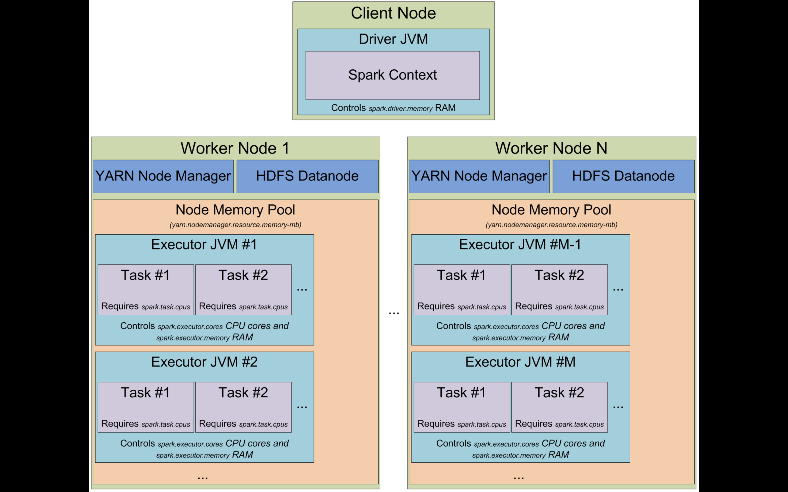
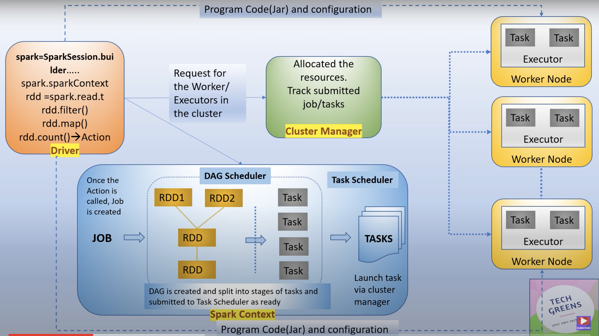
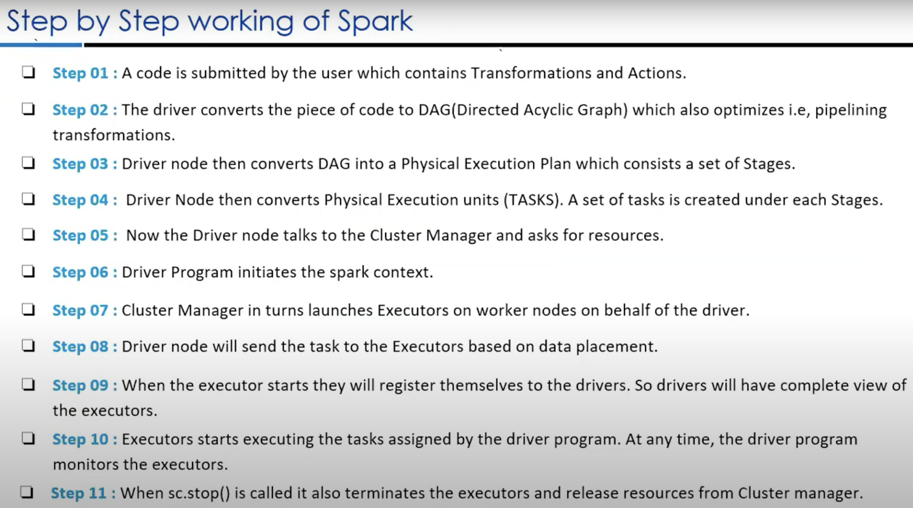
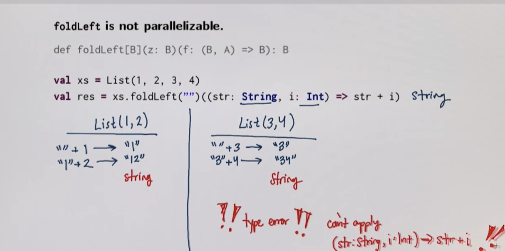
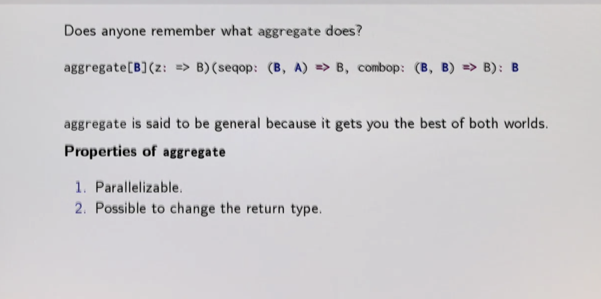
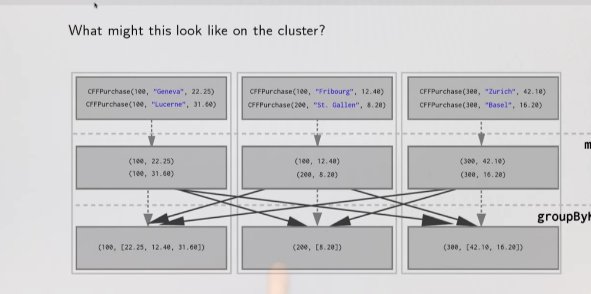
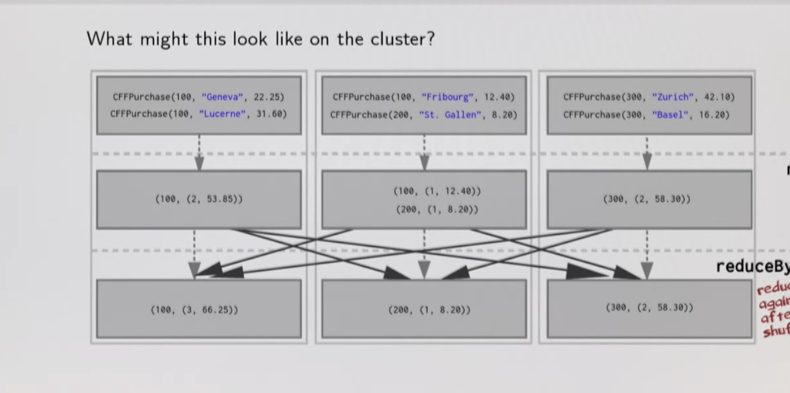
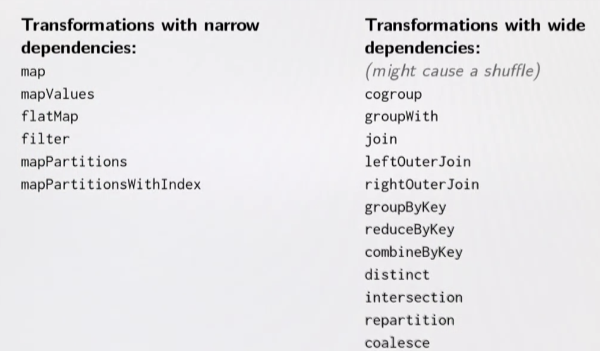
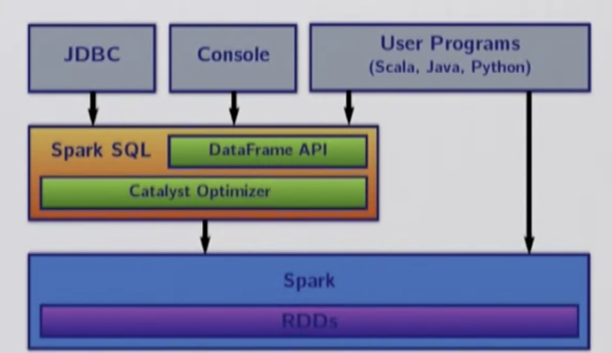
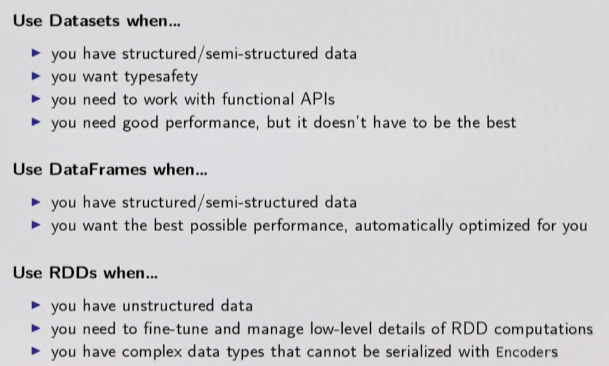

//TODO: Index Creation

## Spark

- Distributed Processing Engine(Why distributes? For parallel processing) 
- Execution engine like MapReduce (Fault tolerant)
- In Memory Execution (Keeps all data immutable and in-memory)
- Sql Support
- Can read write data from any platform e.g. RDBMS, Data-Warehouse, NoSql, SAP, MainFrame, Salesforce 
- Spark is a processing engine runs on Hadoop , HDFS primary storage, YARN cluster manager 
- Hadoop different tools - Pig (Scripting), Hive (SQL), Mahout(ML), Oozie(Workflow)
- Spark - Spark streaming, SQL, Mlib, GraphX, Spark Core (Execution Engine - RDD for batch processing)

- In the shared memory case, you have this data-parallel programming model, this collections programming model. And underneath the hood, the way that it's actually executed is that the data is partitioned in memory.And then operated upon in parallel by independent threads or using a thread pool or something like that
- In the distributed case, we have the same collection abstraction we did in parallel model on top of this distributed execution. But now instead we have data between machines, the network in between which is important. And just like in a shared memory case we still operate on that data in parallel. (Concern of latency between workers)


### Terminologies

- **RDD (Resilient Distributed Datasets)** : RDD is Spark’s core abstraction as a distributed collection of objects. It is an Immutable dataset which cannot change with time. This data can be stored in memory or disk across the cluster. The data is logically partitioned over the cluster. It offers in-parallel operation across the cluster.As RDDs cannot be changed it can be transformed using several operations. Those are Transformation and Action operations. Furthermore, RDDs are fault Tolerant in nature. If any failure occurs it can rebuild lost data automatically through lineage graph [DAG] . 
- **Partitions** : To speed up the data processing, term partitioning of data comes in. Basically, Partition means logical and smaller unit of data. Partitioning of data defines as to derive logical units of data. 
- **Cluster Manager** :Cluster manager runs as an external service which provides resources to each application. This is possible to run Spark on the distributed node on Cluster. Spark supports following cluster managers. First is Apache Spark Standalone cluster manager, the Second one is Apache Mesos while third is Hadoop Yarn. Hence, all cluster managers are different on comparing by scheduling, security, and monitoring. As a matter of fact, each has its own benefits. No doubt, We can select any cluster manager as per our need and goal. 
- **Worker Node** : A worker node refers to a slave node. Actually, any node which can run the application across the cluster is a worker node. In other words, any node runs the program in the cluster is defined as worker node. 
- **Executor** : An executor is a single JVM process which is launched for an application on a worker node. Executor runs tasks and keeps data in memory or disk storage across them. Each application has its own executors. A single node can run multiple executors and executors for an application can span multiple worker nodes. An executor stays up for the duration of the Spark Application and runs the tasks in multiple threads. The number of executors for a spark application can be specified inside the SparkConf or via the flag –num-executors from command-line. 
- **Task** : A Task is a unit of work that is sent to any executor. 
- **Stage** : Each job is divided into small sets of tasks which are known as stages. 
- **Driver Program** : The driver program is the process running the main() function of the application. It also creates the SparkContext. This program runs on a master node of the machine. In the meantime, it also declares transformations and actions on data RDDs. 
- **Action** : Actions refer to an operation. It includes reducing, counts, first and many more. However, it also applies to RDD that perform computations. Also, send the result back to driver program. 
- **Lazy Evaluation** : It optimises the overall data processing workflow. Lazy evaluation means execution is not possible until we trigger an action. ultimately, all the transformations take place are lazy in spark.
- **Data Frame** : It is an immutable distributed data collection, like RDD. We can organise data into names, columns, tables etc. in the database. This design makes large datasets processing even easier. It allows developers to impose distributed collection into a structure and high-level abstraction. 
- **Datasets** : To express transformation on domain objects, Datasets provides an API to users. It also enhances the performance and advantages of robust Spark SQL execution engine. 
- **Spark Context** : Spark context holds a connection with Spark cluster manager. While Co-ordinated by it, applications run as an independent set of processes in a program.


### Spark Architecture

- Resources will be given by Cluster Manager eg: [YARN](Hadoop.md#yet-another-resource-negotiator-yarn) 
- Resources are given inform of executor, Executor is combination of CPU and RAM.
- Data Node 1 - Driver program starts on one of the machine - contains settings to run the programs - resources, compressions, initialising the object . Will create spark context object. 
- Using this driver program will talk to cluster manager. 
  
  **_Once Driver has the resource based on the logic written in driver class, it will create a logical plan and then will create a DAG and then create an execution plan, as part of this it will divide the whole logic into stages and stages are further divided into tasks which are executed into nodes_**







- Spark uses concept called partitioning. partitions data and feeds to executors which then divides it into task 
- Spark Streaming - runs 24x7 unlike batch processing, challenge - resources - hence dynamic resource allocation
- Fault tolerant 
- Integration with other libraries

- **Spark Streaming (RDDs) uses Java Serialisation which helps in catch-point (restart in case of failure), but when there is upgrade it risks backward compatibility.** 
- Hence, Spark Structured Streaming(Dataset and dataframes) was introduced.
- **Spark Streaming - Micro Batch processing DStream (Batch Interval), each batch represents a RDD,** 
- Spark Structured Streaming - Polls data after some duration, received data is triggered and appended in continuous flow, Dataframes are more optimised

### Spark Working Steps



## Lineages

- Computation on RDDs are represented as lineage graph; a Directed Acyclic Graph (DAG) representing the computation done on the RDD
- Recovering from failures by recomputing lost partitions from Lineage Graphs
- Fault tolerant without having to write data to disk

## DAG

- Its set of edges and vertices, vertices represent RDDs and edges represent operation to be performed on RDDs
- Every edge directs from earlier to later in sequence
- On calling of _Action_ , created DAG is submitted to DAG scheduler which further splits graph into stages of the task based on the demarcation of shuffling, new stages is created based on the data shuffling requirement.
- Using DAG we can go any deep dive into what's happening in each stage. Scheduler splits the spark RDD into various stages based on transformation applied Narrow vs Wide.
- Each Stage has multiple tasks, these stages are based on partition of RDDs, so that same computation can be performed in parallel.

[Apache Spark’s DAG and Physical Execution Plan](https://www.tutorialkart.com/apache-spark/dag-and-physical-execution-plan/)

## Spark Context vs Spark Session

Spark Context :

- SparkContext is the entry point of Spark functionality.
- Spark context allows Spark Application to access Spark Cluster with the help of Resource Manager
```scala
val sparkConf = new SparkConf().setAppName("SparkContextExample").setMaster("local")
//create spark context object
val sc = new SparkContext(conf)

sc.textFile
sc.sequenceFile
sc.parallelize

sc.stop()
```

Spark Session :

- Spark session is a unified entry point of a spark application from Spark 2.0. It provides a way to interact with various spark’s functionality with a lesser number of constructs. Instead of having a spark context, hive context, SQL context, now all of it is encapsulated in a Spark session.
- Every user can work in an isolated way

```scala
val spark = SparkSession.builder
.appName("SparkSessionExample") 
.master("local[4]") 
.config("spark.sql.warehouse.dir", "target/spark-warehouse")
.enableHiveSupport()
.getOrCreate

spark.newSession()

spark.sparkContext.parallelize
```

### Driver vs Executor

- **Driver** is a Java process.The main() method of our program runs in the Driver process. It creates SparkSession or SparkContext.Conversion of the user code into Task (transformation and action).Helps to create the Lineage, Logical Plan and Physical Plan.Once the Physical Plan is generated, the Driver schedules the execution of the tasks by coordinating with the Cluster Manager.Keeps track of the data (in the form of metadata) which was cached (persisted) in Executor’s (worker’s) memory.
- **Executor** is just CPU and RAM. Executor resides in the Worker node.

[How to know which piece of code runs on driver or executor?](https://codeutility.org/apache-spark-how-to-know-which-piece-of-code-runs-on-driver-or-executor-stack-overflow/)

### Executor vs Executor Core

- **Executor** - _Refer to terminologies section above_.
- **Executor Cores** is the no. thread started by container, tied to the executor. A core is a basic computation unit of CPU and a CPU may have one or more cores to perform tasks at a given time. The more cores we have, the more work we can do. In spark, this controls the number of parallel tasks an executor can run.

### RDD (Resilient Distributed Dataset)

- Basic DS of Spark Framework
- Immutable distributed collection of objects
- Each dataset in RDD is divided into logical partitions, which may be computed on different nodes of cluster
- RDD can contain any type of object Java, Scala, Python, including user defined object
- Every RDD by default has 2 partitions
- All signature are same except **.aggregate** which has binding parameter (Call be ref) which can cause issue over network

### RDD Representation

- Partitions : Atomic piece of dataset. One or more per compute node.
- Dependencies : Model relation between this RDD and its Partitions with RDDs it was derived from
- A function for computing the dataset based on its parent RDD
- Metadata about partitioning scheming and data placement 

### Ways to create RDD

- Transform existing RDD
- From a SparkContext (or SparkSession) object
  * parallelize : convert a local Scala Collection to a RDD
  * textFile : read a text file from HDFS or a local file system and return  an RDD of string

### Types of RDD

- Parallel Collection RDD - is a RDD of a collection of elements with number of partitions. **sc.parallelize(1 to 10, 2)**
- Shuffled RDD - is a key value pair that represents shuffle step in RDD lineage. These RDDs are created after RDD transformations that trigger data shuffling across nodes in cluster
- Pair RDD -  is a key value pair where in similar operations needs to be performed on each key. **rdd.map(x => (x.1,x.2))**
- Hadoop RDD - provide core functionalities for reading data stored in HDFS, SparkContext: Hadoop file, text file, sequence file


### Operations in RDD

Two types of data ops:
1. Transformations will return a new RDD and are **lazy ops** . eg: filter, map, flatMap, distinct. union, intersection, subtract, cartesian
2. Action will return a value and are **eager ops** .  eg: collect, count, take, reduce, foreach. takeSample, takeOrdered, saveAsTextFile, saveAsSequenceFile

**foreach is an eager action but return unit hence it executes on executor and not driver whereas take returns a type A hence it executes on driver Node**

Dataframes - is a Dataset organised into named columns,  equivalent to a RDBMS table, with richer optimisation under-hood.


### Caching and Persist

```scala
val lastYearLogs : RDD[String] = ???
val logsWithError = lastYearLogs.filter(log => log.contains("ERROR")).persist() //logsWithError will be called N times if we don't persist
val first10LogsWithError = logsWithError.take(10)
val numErrors = logsWithError.count()
```

Possible to persist data set:
- In memory as regular Java Objects
- On disk as regular Java Objects
- In memory as regular Serialised Java Objects (More Compact)
- On disk as regular Serialised Java Objects (More Compact)
- both in memory and on disk (spill over to disk to avoid re computation)

Cache : Shorthand for using default storage level, which is in-memory only as regular java objects
Persist : Persistence can be customised with this method. Pass the storage level you'd like as a parameter to persist.


- Cache is wrapper on top of Persist API `Cache() = Persist(StaorageLevel.MEMORY_ONLY)`
- By Default Cache is in Memory and is a deserialized object
- Spark UI -> Storage (Fraction Memory -> Percentage of data stored, Size on memory, Size on disk)

```scala
import scala.util._
import org.apache.spark.sql.functions._

val df1 = Seq.fill(50)(Random.nextInt()).toDF("C1")
val df2 = df1.withColumn("C2",rand()).join(df1,"C1").cache()
val df3 = df2.withColumn("C3",rand()).join(df1,"C2").persist(StaorageLevel.DISK_ONLY)
val df4 = df3.withColumn("C4",rand()).join(df1,"C3")
val df5 = df4.withColumn("C5",rand()).join(df1,"C4")
val df6 = df5.withColumn("C6",rand()).join(df1,"C5")

```

- [Scala : fold vs foldLeft - Why fold can run in parallel?](https://stackoverflow.com/questions/16111440/scala-fold-vs-foldleft)
- Why Serial foldLeft/foldRight doesn't exist on Spark? Ans : Doing things serially across is difficult. Lots of Synchronisation. Doesn't make a lot of sense



TODO Create A Mapping of Transformations and Actions with clauses:

- sortWith 
- aggregate  in accumulator we would waste a lot of memory and time to carry all unrelated fields 
- groupByKey  - index (Transformation - lazy)
- reduceByKey - more efficient than groupByKey and then reduce     (Transformation - lazy)
- countByKey  - no of elements per key  (Transformation - lazy)
- mapValues   - only applies to Pair RDD (Action - eager) (org, budget) mapValues (org, (budget,1))
- keys - (Transformation - lazy)
- join - (Transformation - lazy)
- leftOuterJoin/rightOuterJoin 
- collect sortBy 
- mapPartitions 
- mapParallel 
- reduce

## Shuffle

- Shuffles can be an enormous hit to performance because it means that Spark has to move a lot of its data around the network and remember how important latency is.
- A Shuffle can occur when the resulting RDD depends on other elements from same RDD or another RDD

### GroupByKey vs ReduceByKey

GroupByKey



ReduceByKey




### CombineByKey vs ReduceByKey

Reduce by key internally calls combineBykey. Hence the basic way of task execution is same for both.

The choice of CombineByKey over reduceBykey is when the input Type and output Type is not expected to be the same. So combineByKey will have a extra overhead of converting one type to another .

If the type conversion is omitted there is no difference at all .

### Narrow vs Wide Transformation

Transformation causes shuffle. There are two kinds
- Narrow : when each partition of the parent RDD is used by at most one partition of the child RDD. (Fast, No shuffle, Optimisation like pipelining possible)
- Wide :  each partition of the parent RDD may be depended on by multiple children partitions. (Slow, require some data to be shuffled over network)


 
## Partitioning

The data within RDD are split into multiple Spark partitions

### Properties of Partitions

- Partitions never span multiple machines i.e. tuples in same partitions are guaranteed to be on same machine
- Each machine in cluster contain one or more partitions
- Number of partition to use is configurable. By default, It's equal to total number of cores on all executor nodes

Two Types of Partitions:
- Hash Partitioning
- Range Partitioning
- **Custom partitioning only possible on Pair RDDs**

How to Set Partitioning?
- by calling partitionBy on RDD
- using transformations that return RDD with specific partitioner

**map/flatMap operations loses partitioning in result RDD - cause map and flatMap can change the Keys, hence use mapValues**

### Optimising with Partitioner

Partitioning can bring enormous performance gains, especially in the face of operations that may cause shuffles. The basic intuition is that if you can somehow optimize for data locality, then you can prevent a lot of network traffic from even happening.


## Structure vs Unstructured Data

- Object blobs and HOF falls into unstructured and spark can't look inside it and hence can't optimise. (We have to do it)
- Database/Hive are structured and Spark can optimise on its own

## Spark SQL



Three main APIs:
- SQL Literal Syntax
- Dataframes
- Datasets

Two specialised backend components:
- Catalyst, query optimiser
- Tungsten, off-heap serializer

### Data Frames

- Dataframes is Spark SQL's abstraction
- Dataframes, are conceptually RDDs full of records with a know schema (Kind of like table)
- Dataframes are Untyped
- Transformations are Untyped
- primary interface to create DataFrame is DataFrameReader

Ways to create a dataframe:
- From existing RDD .toDF
- Reading a specific datasource from a file

```scala
case class Department(id: Int,dname:String)
case class Employee(id: Int,fname:String,lname:String,age:Int,city:String,deptId:Int)

val depts = List(Department(1000,"Finance"),Department(1001,"IT"),Department(1002,"HR"),Department(1003,null))
val employees = List(Employee(1,"John","Doe",21,"Sydney",1000),Employee(2,"Jane","Doe",32,"Melbourne",1001),Employee(3,"Jack","Daniel",25,"Sydney",1001),Employee(4,"James","Bond",32,"Victoria",1002),Employee(5,"Jason","Bourne",41,"Sydney",1002),Employee(6,"Jamie","Lannister",51,null,1000),Employee(7,"Jake","Gyllenhaal",28,"Sydney",1004))

val deptDF = sc.parallelize(depts).toDF
val employeeDF = sc.parallelize(employees).toDF

deptDF.show()
employeeDF.show()

val sydneyEmployeeDF =employeeDF.select("id","fname").where("city == 'Sydney'").orderBy("id")
sydneyEmployeeDF.show()

val youngCityEmployeeDF =employeeDF.groupBy("city").min("age")
youngCityEmployeeDF.show()

import org.apache.spark.sql.functions._
val aggCityEmployeeDF =employeeDF.groupBy($"city").agg(count($"city")).orderBy($"count(city)".desc)
aggCityEmployeeDF.show()

val avgCityEmployeeDF =employeeDF.groupBy($"city").agg(sum($"age")/count($"age"))
avgCityEmployeeDF.show()

val joinEmployeeWithDept = employeeDF.join(deptDF, deptDF("id")===employeeDF("deptId")).drop(deptDF("id")).orderBy($"id") //Doesn't give error if given wrong column Name

joinEmployeeWithDept.show()

val leftJoinEmployeeWithDept = employeeDF.join(deptDF, deptDF("id")===employeeDF("deptId"),"left_outer").drop(deptDF("id")).orderBy($"id") //Doesn't give error if given wrong column Name

leftJoinEmployeeWithDept.show()
```

### DF Optimization

Catalyst Optimiser
- Reordering operations
- Reduce the amount of data we must read
- Pruning unneeded Partitions

Tungsten Optimiser
- highly specialise data encoder (tightly serialised hence can keep more data into memory)
- column based
- off heap (free from garbage collection overhead)

### DataSets

- Data Frames are DataSets
- `type DataFrame = Dataset[Row]`
- typed distributed collection of data
- mix RDD and DataFrame operations


Ways to create a DataSets:
- From existing DF.toDS
- Reading a specific datasource from a file. `spark.read.json(""").as[Person]`

```scala
val tupleList = List((1,"One"),(2,"Two"),(3,"Three"),(4,"Four"))
val tupleListRDD = sc.parallelize(tupleList)

tupleListRDD.reduceByKey(_ + _).collect

// equivalent in DS

val tupleListDS = tupleList.toDS
tupleListDS.groupByKey(_._1).mapGroups((k,vs) => (k,vs.foldLeft("")((acc,p)=> acc + p._2))).show()
tupleListDS.groupByKey(_._1).mapValues(_._2).reduceGroups((acc,p)=> acc+p).show()
```

### [DF vs DS vs RDD](https://phoenixnap.com/kb/rdd-vs-dataframe-vs-dataset)




### [Repartition vs Coalesce](https://mrpowers.medium.com/managing-spark-partitions-with-coalesce-and-repartition-4050c57ad5c4)

- Repartition cause Shuffle
- Repartition ensure even distribution of data
- Increase or decrease partitions.
- Results in more or less equal sized partitions.
- Since a full shuffle takes place, repartition is less performant than coalesce.


- Coalesce has no full shuffle, "stitches" partition together
- Only decrease the number of partitions.
- If the number of partitions is reduced from 5 to 2. Coalesce will not move data in 2 executors and move the data from the remaining 3 executors to the 2 executors. Thereby avoiding a full shuffle.Because of the above reason the partition size vary by a high degree.
- When we increase partitions in Coalesce, it is equivalent to Repartition

Finally, When you call the repartition() function, Spark internally calls the coalesce function with shuffle parameter set to true.

```scala
val numbers = sc.parallelize(1 to 10000000)
val repartitionedNumbers = numbers.repartition(2)

repartitionedNumbers.count()


val coalesceNumbers = numbers.coalesce(2)
coalesceNumbers.count()
```

### Spark Performance Tuning : TODO

#### Executor tuning
- Leave aside one core per node : For several daemons running in background like NameNode, Secondary NameNode, DataNode, JobTracker, Task Tracker, Application master etc.
- HDFS Throughput : HDFS client has trouble with tons of concurrent threads, Too many tasks per executor causes Huge GC overheads. It was observed HDFS achieves full write throughput with **5 cores/tasks per executor**
- YARN Application Master : 1 GB and 1 Executor for AM
- Memory Overhead : Full memory requested to yarn per executor = spark-executor-memory + spark-yarn-executor-memoryOverhead
  spark-yarn-executor-memoryOverhead = Max(384 MB, 7% of spark-executor-memory)
  eg : IF we request for 20 GB per executor, AM will get 20 GB + memoryOverhead = 20 + 7% of 20 = 23 GB
- Running executor with too much memory often results in excessive GC delays
- Running tiny executors throws away benefits that comes from running multiple JVM 

[Spark By Example](https://sparkbyexamples.com/spark)


//TODO: Handling data skewness in spark


### Spark Submit options

```editorconfig
"--deploy-mode" , "cluster",                                                                  #YARN mode ; could be client or cluster
"--conf", "spark.yarn.executor.memoryOverhead=1500",                                        #the memory Spark wants to use in each executor for persisting data like Java String literals,etc.
"--conf", "spark.default.parallelism=1024",                                                 #Number of RDD partitions that the entire input (our EC source tiles) gets divided into.
"--conf", "spark.rdd.compress=true",                                                           
"--conf", "spark.executor.userClassPathFirst=true",
"--conf", "spark.driver.userClassPathFirst=true",
"--jars", "s3://here-ngmp-dev-hdmap/libRtl_EarthCoreOpsApiJava.so",                        
"--driver-memory","4G",                                                                     #memory allocated for the driver
"--executor-memory","4G",                                                                   #memory allocated to each executor . This excludes the memory overhead
"--num-executors","2",                                                                      #total number of executors to be requested on the entire cluster. NOTE: Spark is smart and overrides this value if it realizes it needs more/less executors.       
"--executor-cores","2",                                                                     #number of parallel tasks that can run inside each executor
"--class","com.here.hdmap.filters.acf.earthcore.Main",
"s3://here-ngmp-dev-hdmap/shreya-test400/acf400/hdmap-filters-acf-earthcore-impl-1.0.0-SNAPSHOT-jar-with-dependencies.jar"
```


//TODO: Modify using https://github.com/rohgar/scala-spark-4/wiki/Wide-vs-Narrow-Dependencies#visual-narrow-dependencies-vs-wide-dependencies
//TODO: FileAlreadyExistsException way out