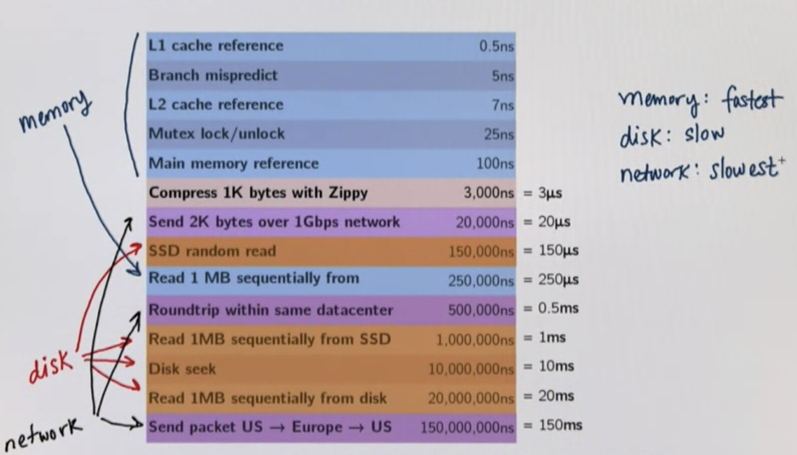
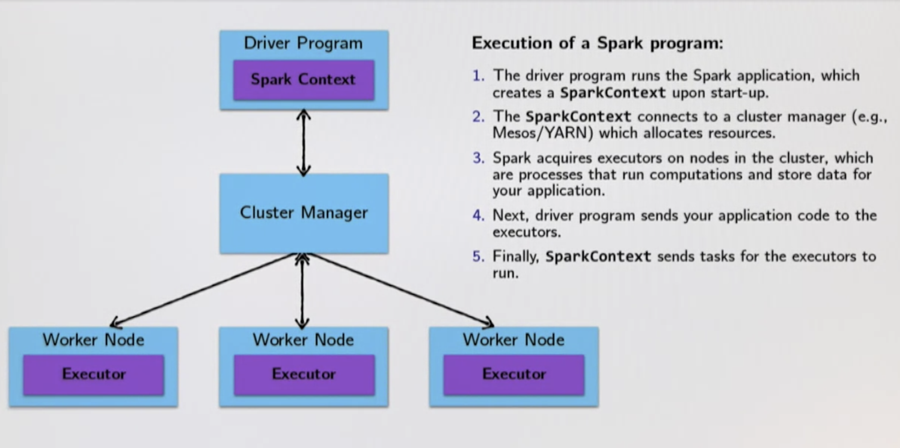
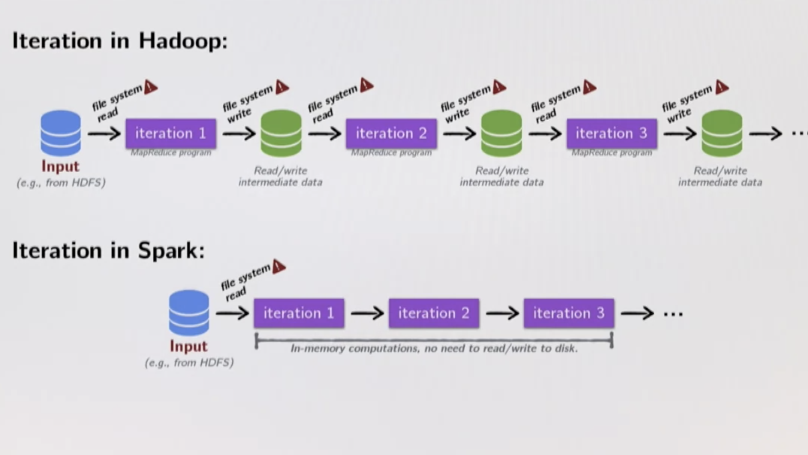
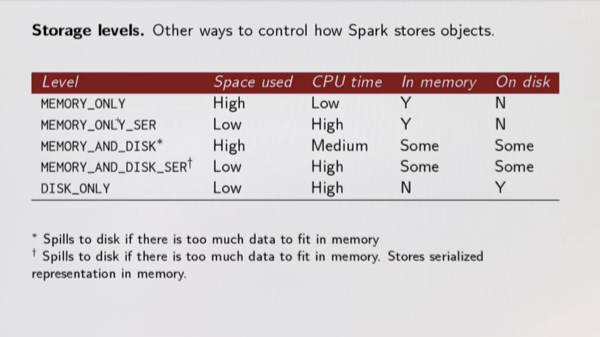

## Hadoop

Has HDFS and MapReduce
- HDFS - is used to distribute the data 
- MapReduce - process data in parallel, fault tolerant. Java, Python,C & C++
- Between each map/reduce steps it shuffles data over network writes intermediate data to disk. (100 times slower than memory)

Abstraction of MapReduce
- Hive (FB) - Interact with sql backend is Java. Query Engine 
- Pig (Yahoo) - PigLatin 
- Scoop (Java) - bring data from RDBMS dump into HDFS and vice Versa 
- Oozie (Java) - Scheduler of jobs (Like Control M)

HBase (FB) -

## Spark

- Distributed Processing Engine(Why distributes? For parallel processing) 
- Execution engine like MapReduce (Fault tolerant)
- In Memory Execution (Keeps all data immutable and in-memory)
- Sql Support
- Can read write data from any platform eg RDBMS, Datewarehouse, NoSql, SAP, MainFrame, Saleforce 
- Spark is a processing engine runs on Hadoop , HDFS primary storage, YARN cluster manager 
- Hadoop different tools - Pig (Scripting), Hive (SQL), Mahout(ML), Oozie(Workflow)
- Spark - Spark streaming, SQL, Mlib, GraphX, Spark Core (Execution Engine - RDD for batch processing)


- In the shared memory case, you have this data-parallel programming model, this collections programming model. And underneath the hood, the way that it's actually executed is that the data is partitioned in memory.And then operated upon in parallel by independent threads or using a thread pool or something like that
- In the distributed case, we have the same collection abstraction we did in parallel model on top of this distributed execution. But now instead we have data between machines, the network in between which is important. And just like in a shared memory case we still operate on that data in parallel. (Concern of latency between workers)

### Latency

Distribution introduces two issues

- Partial failure : crash failure of a subset of machines involved in distributed computation
- Latency : certain operation has higher latency than other operations due to network latency



### Spark Architecture

- Resources will be given by Cluster Manager eg: YARN
- Resources are given inform of executor, Executor is combination of CPU and RAM.
- Data Node 1 - Driver program starts on one of the machine - contains settings to run the programs - resources, compressions, initialising the object . Will create spark context object. 
- Using this driver program will talk to cluster manager



- Spark uses concept called partitioning. partitions data and feeds to executors which then divides it into task 
- Spark Streaming - runs 24x7 unlike batch processing, challenge - resources - hence dynamic resource allocation
- Fault tolerant 
- Integration with other libraries

- Spark Streaming (RDDs) uses Java Serialisation which helps in catchpoint (restart in case of failure), but when there is upgrade it risks backward compatibility. 
- Hence, Spark Structured Streaming(Dataset and dataframes) was introduced.
- Spark Streaming - Micro Batch processing DStream (Batch Interval), each batch represents a RDD, 
- Spark Structured Streaming - Polls data after some duration, recevied data is triggered and appended in continous flow, Dataframes are more optimised


### RDD (Resilient Distributed Dataset)

- Basic DS of Spark Framework
- Immutable distributed collection of objects
- Each dataset in RDD is divided into logical partitions, which may be computed on different on different nodes of cluster
- RDD can contain any type of object Java, Scala, Python, including user defined object
- All signature are same except **.aggregate** which has binding parameter (Call be ref) which can cause issue over network

### Ways to create RDD

- Transform existing RDD
- From a SparkContext (or SparkSession) object
  * parallelize : convert a local Scala Collection to a RDD
  * textFile : read a text file from HDFS or a local file system and return  an RDD of string

### Types of RDD

- Parallel Collection RDD - is a RDD of a collection of elements with number of partitions. sc.parallelize(1 to 10, 2)
- Shuffled RDD - is a key value pair that represents shuffle step in RDD lineage. These RDDs are created after RDD transformations that trigger data shuffling across nodes in cluster
- Pair RDD -  is a key value pair where in similar operations needs to be performed on each keys
- Hadoop RDD - provide core functionalities for reading data stored in HDFS, SparkContext: Hadoop file, text file, sequence file


### Operations in RDD

Two types of data ops:
1. Transformations will return a new RDD and are **lazy ops** . eg: filter, map, flatMap, distinct. union, intersection, subtract, cartesiN
2. Action will return a value and are **eager ops** .  eg: collect, count, take, reduce, foreach. takeSample, takeOrdered, saveAsTextFile, saveAsSequenceFile

**foreach is a eager action but return unit hence it executes on executor and not driver whereas take returns a type A hence it executes on driver Node**

Big data processing is just computation of iterative algorithms. Below is difference between Hadoop and Spark:



90% of the time is spent in hadoop in IOps, it also involves killing JVM per iteration and rebooting.

Dataframes - is a Dataset organised into named columns,  equivalent to a RDBMS table, with richer optimisation underhood.


### Caching and Persist

```scala
val lastYearLogs : RDD[String] = ???
val logsWithError = lastYearLogs.filter(log => log.contains("ERROR")).persist() //logsWithError will be called N times if we don't persist
val first10LogsWithError = logsWithError.take(10)
val numErrors = logsWithError.count()
```

Possible to persist data set:
- In memory as regular Java Objects
- On disk as regular Java Objects
- In memory as regular Serialised Java Objects (More Compact)
- On disk as regular Serialised Java Objects (More Compact)
- both in memory and on disk (spill over to disk to avoid re computation)

Cache : Shorthand for using default storage level, which is in-memory only as regular java objects
Persist : Persistence can be customised with this method. Pass the storage level you'd like as a parameter to persist.

